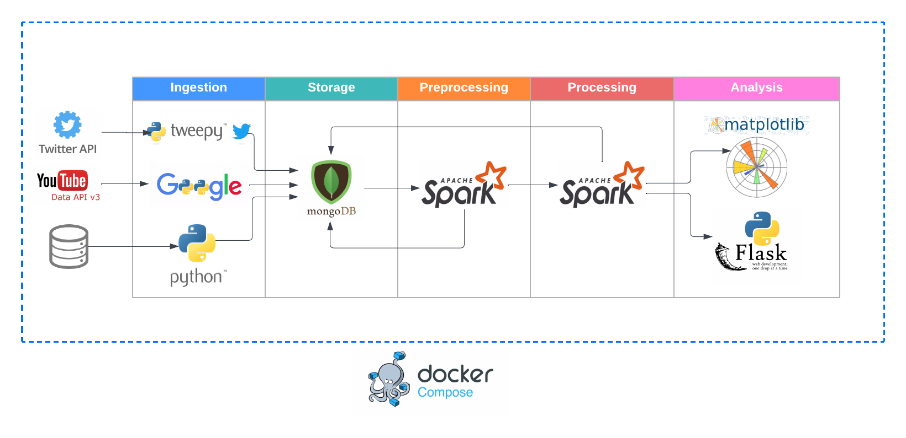

### Social media sentiment analysis

---

***Abstract***

This project focuses on developing a data processing system for analyzing social media data, specifically tweets. The goal is to extract valuable insights and perform sentiment analysis to understand public opinion and trends. Through data exploration and the implementation of a robust pipeline, the project has successfully collected and processed a large volume of tweets, conducted sentiment analysis, and stored the processed data. The system enables users to gain valuable insights from social media data for various applications such as market research and brand monitoring.

---

##### Technologies

+ Spark
+ MongoDB
+ Docker with compose
+ Flask

---

##### Architecture

---
